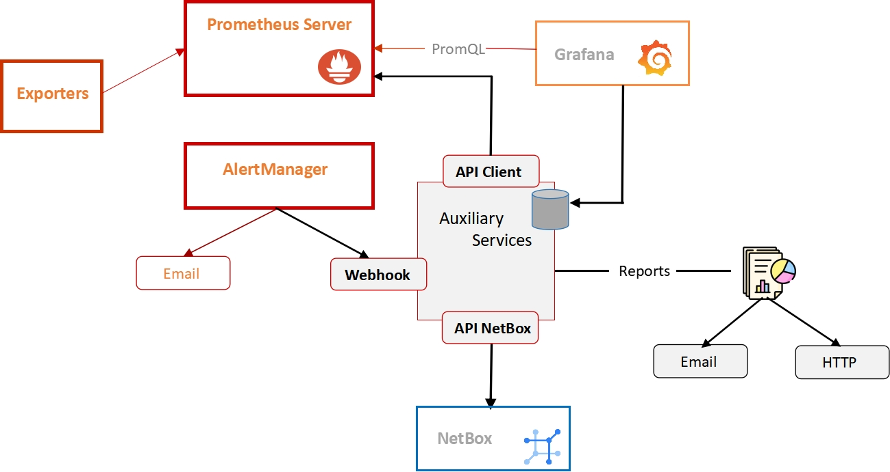

# PrometheusCollection

> Para a construção dos reports, é importante que esta primeira parte do projeto seja concluída. Nesta fase, estaremos obtendo informações de jobs, instâncias e métricas atuamente monitoradas pelo Prometheus, utilizando apis que gerem instruções PromQL. Ao mesmo tempo, estarão sendo coletadas informações dos devices e das vms no NetBox para efetuar a comparação com os dados do Prometheus.

### Ajustes e melhorias

O projeto ainda está em desenvolvimento e as próximas atualizações serão voltadas para as seguintes tarefas:

- [x] Tarefa 1: coleta de dados e formatos provenientes do Prometheus e do NetBox
- [x] Tarefa 2: utilização do framework web Flask para interfaceamento com usuário, alertmanager e comunicação entre threads internas 
- [x] Tarefa 3: design da coleta e banco de dados visando integração com Grafana;p
- [x] Tarefa 4: integrações com emails (notificações)

### Install

Antes de instalar os requirements, instale Python (versão igual ou superior a 3.6) e pip. Recomenda-se utilizar um ambiente virtual (vevn) para execução do código.

Verifique as versões instaladas, utilizando:
    $ /usr/bin/env python3 -V
    $ pip3 -V

Trazendo a versão recém instalada, execute:
    $ pip3 install -r requirements.txt

### Run

$ cd <dir_instalacao>
$ ./getPrometheusData.py <prometheus endpoint>

Exemplo: getCollection.py http://172.16.10.208:9091
Após o término do comando, o log prometheus.log será gerado. Envie o resultado para análise e prosseguimento das Tarefas.

$ ./getNetBoxData.py <netbox_url> <netbox_token>

Após o término do comando, o log netbox.log será gerado. Envie o resultado para análise e prosseguimento das Tarefas.

